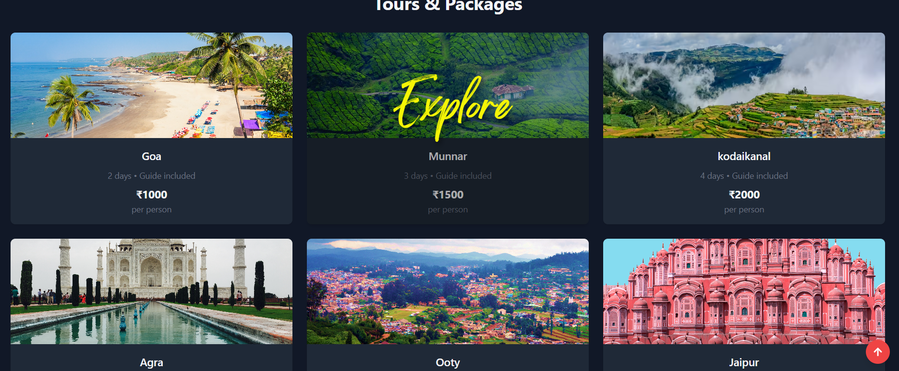
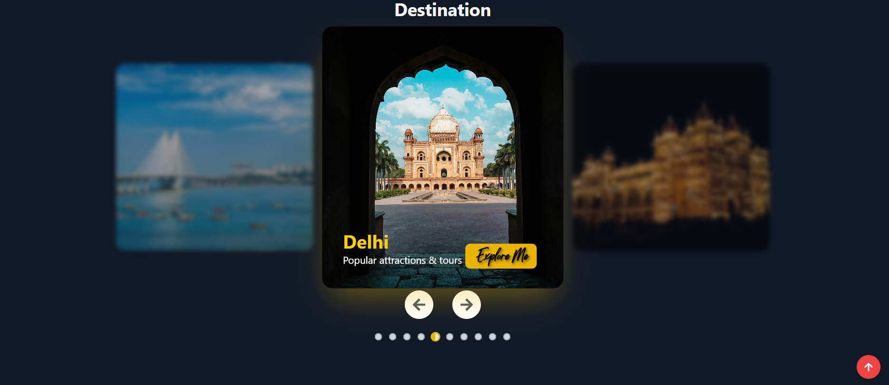
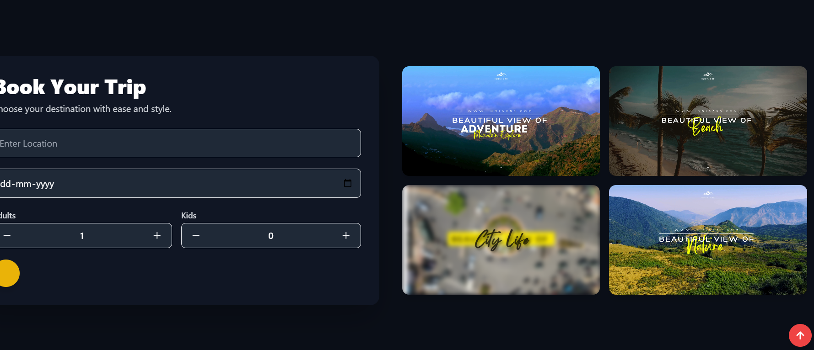
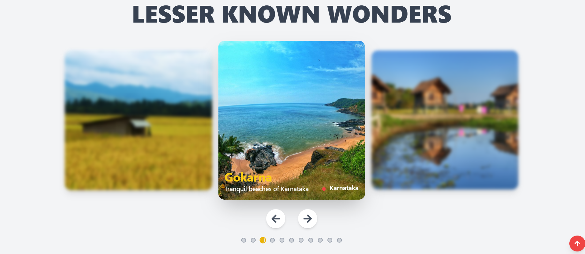

# 🌏 India 360 – Tourism Website

A modern multi-page tourism website built with **React**, **React Router**, and **Tailwind CSS**.  
It showcases destinations, packages, booking features, and a responsive design for mobile, tablet, and desktop.

---

## 🚀 Features

- 🎥 **Hero Carousel** with autoplay videos/images and smooth transitions
- 🔎 **Search with autocomplete** for destinations
- 📦 **Tour Packages** with details & explore pages
- 🛎 **Booking form** for trips
- 🌓 **Dark & Light mode toggle**
- 📱 **Fully responsive** – works on mobile, tablet, and desktop
- 🎨 **Modern UI** with animations (AOS + Tailwind transitions)

---

## 🖼️ Screenshots

### Hero Section


### Packages Page



### DEstination Page



### Book Page



### Gallery Page



---

## 🛠️ Tech Stack

- **Frontend:** React 18, React Router 6, Tailwind CSS
- **Icons:** Lucide React, React Icons
- **Animations:** AOS (Animate on Scroll)
- **Build Tool:** Vite

---

## ⚙️ Setup & Installation

1. Clone the repo:
   ```bash
   git clone https://github.com/your-username/india-360.git
   cd india-360
   npm install
   npm run dev

   ```
